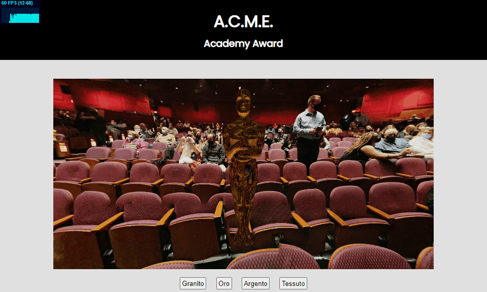

# Product Configuration

## Obiettivo
Il codice ha l'obiettivo di realizzare un product configuration online per un prodotto fisico. Il prodotto scelto è l'Academy Award, disponibile in granito, oro, argento e tessuto.

## Uso di texture PBR-ready
Per la realizzazione dei materiali sono state usate diverse texture PBR-ready. Queste implementano:
  - normal map, per aggiungere un effetto alla superifice per la quale questa ha delle irregolarità visibili ma molto piccole
  - roughness map, per controllare la ruvidità di un materiale
  - specular map, per distinguere zone più lucide e più opache

## Shaders
Gli shader realizzati sono due diversi, utilizzati in situazioni diverse
  - vertex / fragment -reflection, usato per i materiali metallici che riflettono l'ambiente. In questo caso viene aggiunta una luce spotlight.
  - vertex / fragment -noreflection, usato per i materiali non metallici. In questo caso si usa una irradiance map, creata con cmftStudio, per calcolare l'illuminazione fornita dall'ambiente. 

## Controllo del framerate e Tone Mapping
In alcune schede video si è notato un abbassamento momentaneo dei fotogrammi al secondo: per risolvere questo problema si è scelto di inserire del codice per generare al massimo 60 FPS.

Il tone mapping scelto è ACESFilmicToneMapping.